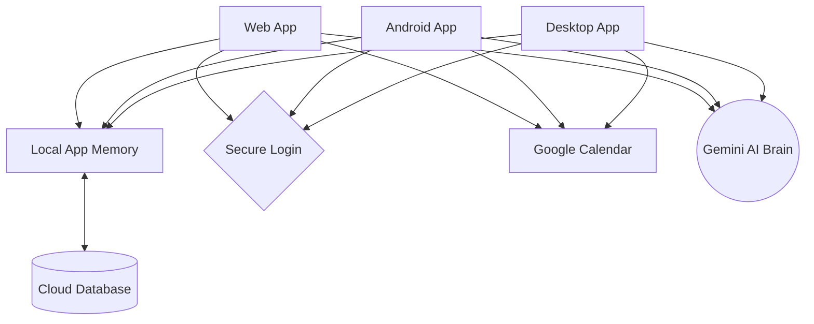

# Personal Hub
> A modern, premium command center for your digital life. 

**Personal Hub** is a cross-platform, AI-powered productivity suite designed for individuals who demand a fast, beautiful, and fully-featured digital workspace. Built in 2026, it merges aesthetics and functionality to offer an unparalleled user experience, running seamlessly on Android, Desktop (Linux/Windows/macOS), and the Web.

---

##  Features

- **AI Schedule Assistant (Powered by Gemini):** Automatically build an optimized daily schedule around your classes, to-do lists, and weekly goals with one click.
- **AI Timetable Scanner:** Upload a photo of your schedule and Gemini automatically parses it into your weekly classes.
- **Real-Time Sync:** Never lose your data. Firebase Realtime Database synchronizes your habits, tasks, finances, and goals instantly across all your devices.
- **Financial Tracking:** Visualize your income and expenses effortlessly using beautiful Recharts diagrams and one-click PDF generation.
- **Goals & Habits Tracking:** Set, monitor, and crush your daily habits and monthly goals with intuitive progress indicators.
- **Secure Authentication:** Safe, reliable email/password authentication via Firebase Auth to protect your private data.

---

## Tech Stack

Personal Hub is engineered with cutting-edge tools to maximize performance and cross-platform reach.

- **Frontend:** React 19, TypeScript, Vite
- **Styling:** Tailwind CSS 4, Framer Motion, Lucide React
- **State Management:** Zustand (with persist)
- **Backend & Sync:** Firebase (Auth & Realtime Database)
- **AI Integration:** Google GenAI (Gemini 3.1 Flash)
- **Mobile Build:** Capacitor (Android/iOS)
- **Desktop Build:** Electron & Capacitor-Community Electron (Windows/macOS/Linux)

---

## Architecture & Pipeline

### How It Works (Simple Explanation)

Personal Hub is designed to work everywhere you do. Here is a simple breakdown of how the different pieces fit together:

1. **The Apps (Frontend):** You can use the app on the Web, on your Android phone, or as a Desktop app. They are built to share the exact same code and design.
2. **The Memory (State Management):** When you do something in the app (like adding a task), it gets saved in a local memory bank immediately. This makes the app feel incredibly fast because it doesn't have to wait for the internet.
3. **The Brain (AI Integration):** When you need a schedule made or a timetable scanned, the app securely sends that request to Google's Gemini AI, which acts as the smart brain to organize your life.
4. **The Cloud (Backend Services):** To make sure your phone and laptop have the exact same data, the app securely backs up your memory to a real-time Cloud Database. It also talks to Google Calendar to automatically add your classes to your schedule!



---

## Getting Started

### 1. Prerequisites
- Node.js (v18+)
- A Google AI Studio API Key (You can configure this inside the app's Settings page!)
- Firebase Project configured (with Realtime Database and Auth enabled).

### 2. Installation
```bash
# Clone the repository
git clone https://github.com/your-username/personal-hub.git
cd personal-hub

# Install all dependencies
npm install
```

### 3. Running Locally (Web)
```bash
npm run dev
```

### 4. Building for Linux / Desktop
Personal Hub fully supports Linux (AppImage & deb).
```bash
# Compile and package for Linux
npm run build:linux
```
Your compiled `.AppImage` will be waiting for you in the `electron/dist` folder!

### 5. Building for Android
```bash
npx cap sync android
npx cap open android
```
*(Requires Android Studio).*

---

## Configuration

Say goodbye to messy `.env` files. **Personal Hub features a built-in Settings page!** 
Simply navigate to the **Settings** tab within the app to:
- Enter and securely save your **Gemini API Key**.
- Set your **Profile Name**.
- Toggle high-performance **Animations** on or off.

---

## License

This project is licensed under the **MIT License** — see the [LICENSE](LICENSE) file for details.

---

## ⭐ Support the Project

If **Personal Hub** makes your life even a little bit more organised, the best way to show support is to **star this repository**! It takes one second and genuinely means a lot.

[](https://github.com/CODER-7777/personal-hub)

> ⭐ **[Click here to star Personal Hub on GitHub](https://github.com/CODER-7777/personal-hub)** — it helps the project grow and reach more people!

---

## 🐛 Reporting Issues

Found a bug? Have a feature request? I'd love to hear from you!

**Before opening an issue, please:**
1. Check if the issue [already exists](https://github.com/CODER-7777/personal-hub/issues) in the issue tracker.
2. Make sure you are on the **latest release**.

**To report a bug, [open a new issue](https://github.com/CODER-7777/personal-hub/issues/new) and include:**
- A clear title describing the problem
- Steps to reproduce it
- What you expected to happen vs. what actually happened
- Your platform (Web / Android / Desktop) and OS version
- Screenshots or screen recordings if possible

**For feature requests**, open an issue with the label `enhancement` and describe what you'd like to see added and why it would be useful.

---

## 🤝 Contributing

Contributions are welcome! If you'd like to fix a bug or add a feature:

1. **Fork** the repository
2. Create a new branch: `git checkout -b feature/your-feature-name`
3. Make your changes and commit: `git commit -m "Add: your feature description"`
4. Push to your fork: `git push origin feature/your-feature-name`
5. Open a **Pull Request** against the `main` branch

Please keep PRs focused and well-described. Large changes should be discussed in an issue first.

---

*Developed with ❤️ by [Mansoju Vivekananda](https://github.com/CODER-7777)*
